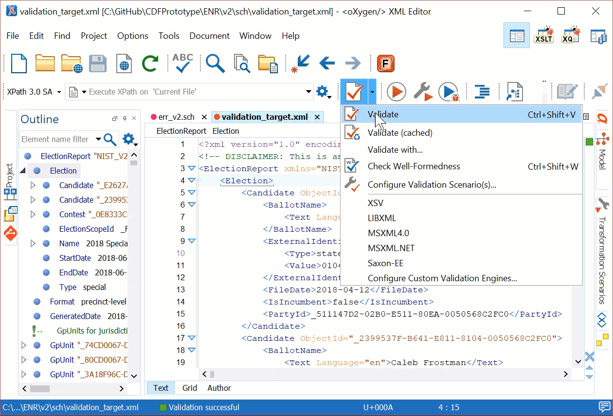

# Schematron Rulesets

<!-- TOC -->

- [Schematron Rulesets](#schematron-rulesets)
    - [How to run (AltovaXML)](#how-to-run-altovaxml)
    - [How to Run (Oxygen XML)](#how-to-run-oxygen-xml)

<!-- /TOC -->

## How to run (AltovaXML)

AltovaXML can run a schematron ruleset that has been compiled into an `xslt`, e.g. `err_v2-compiled.xsl`.

- Clone this repository.

- [Download](http://cdn.sw.altova.com/v2013r2/en/AltovaXMLCmu2013.exe) and install AltovaXML.

> AltovaXML must be in your path or fully qualified. The default installation path for x64 based computers is `C:\Program Files (x86)\Altova\AltovaXML2013`

- Run the command having the form of:

```cmd
{AltovaXML} /xslt2 {diag-compiled.xsl} /in {input_file.xml}
```

Where `{AltovaXML}` is the path to the `AltovaXML.exe` executable, `{diag-compiled.xsl}` is the path to the compiled schematron ruleset, and `{input_file.xml}` is the path to the XML instance to validate.

```cmd
PS C:\Program Files (x86)\Altova\AltovaXML2013> .\AltovaXML.exe /xslt2 C:\GitHub\CDFPrototype
\ENR\v2\sch\err_v2-compiled.xsl /in C:\GitHub\CDFPrototype\ENR\v2\sch\validation_target.xml
```

## How to Run (Oxygen XML)

The commercial XML editor Oxygen can validate using schematron rulesets directly. Make sure schema-aware validation is enabled and Saxon-EE is used for validation.


The below video shows how to validate a XML instance using the `sch` ruleset.



> These instructions were tested on Windows 10.0.17134.648 (x64)