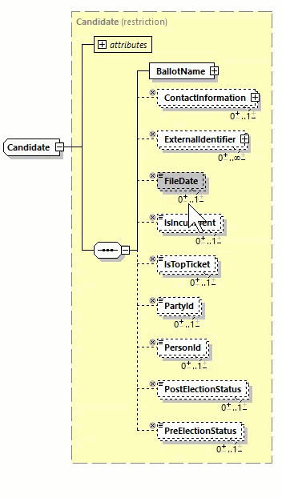

# Subsetting CDF Schemas

The NIST SP Common Data Format (CDF) each support multiple use-cases. A use-case is an application of the common data format for a particular purpose. The CDFs are flexible enough to handle multiple use-cases simultaneously, but there is a tradeoff. The exact data points required for each use-case are not explicitly specified in the CDF. An example would be the Election Results Reporting (ERR) Specification. Making vote counts required for an election night use-case would preclude its use for pre-election day purposes.

The CDFs can be subset or profiled to better represent the use-case their are implementing. This provides the following benefits:

- Clearly states what a particular data exchange requires
- Provides a data format that can be effectively tested by VSTLs for conformance
- Can be used as a mechanism for election jurisdictions to specify their interoperability requirements in an unambiguous way.

This document describes a number of mechanisms to accomplish this task.

<!-- TOC -->

- [Subsetting CDF Schemas](#subsetting-cdf-schemas)
    - [Subsetting with XML](#subsetting-with-xml)
        - [Technique 1: Redefinition](#technique-1-redefinition)
            - [complexType Example](#complextype-example)
            - [simpleType Example](#simpletype-example)
            - [Limitations](#limitations)
    - [Subsetting with JSON](#subsetting-with-json)

<!-- /TOC -->

## Subsetting with XML

### Technique 1: Redefinition

XML Schema (XSD) 1.0 and higher support a feature called redefinition, which can be used to subset a schema. A redefined schema takes as its base an existing schema, in our case a NIST 1500 series Common Data Format (CDF). We can then **redefine** types in the schema, essentially giving them new definitions.

Use-cases for redefinition

- Disallow certain components
- Change the occurrence of certain elements
- Restrict allowed enumeration values

> XSD 1.1 introduces a new method of subsetting called `override`. This method is preferred if you have access to a XSD 1.1 schema validator.

#### complexType Example

Suppose we want to require that an election management system (EMS) must provide the filing date (`FileDate`) and person record identifier (`PersonId`) for each `Candidate` in an pre-election Election Results Reporting (ERR) feed.

By looking at the definition of `Candidate`, we see that `FileDate` and `PersonId` are optional (`minOccurs="0"`) in the 1500-100 schema, so we will need to redefine `Candidate`. The existing definition is below:

```xml
<xsd:complexType name="Candidate">
    <xsd:sequence>
        <xsd:element name="BallotName" type="InternationalizedText"/>
        <xsd:element name="ContactInformation" type="ContactInformation" minOccurs="0"/>
        <xsd:element name="ExternalIdentifier" type="ExternalIdentifier" minOccurs="0" maxOccurs="unbounded"/>
        <xsd:element name="FileDate" type="xsd:date" minOccurs="0"/>
        <xsd:element name="IsIncumbent" type="xsd:boolean" minOccurs="0"/>
        <xsd:element name="IsTopTicket" type="xsd:boolean" minOccurs="0"/>
        <xsd:element name="PartyId" type="xsd:IDREF" minOccurs="0"/>
        <xsd:element name="PersonId" type="xsd:IDREF" minOccurs="0"/>
        <xsd:element name="PostElectionStatus" type="CandidatePostElectionStatus" minOccurs="0"/>
        <xsd:element name="PreElectionStatus" type="CandidatePreElectionStatus" minOccurs="0"/>
    </xsd:sequence>
    <xsd:attribute name="ObjectId" type="xsd:ID" use="required"/>
</xsd:complexType>
```

A redefined schema section starts with a `redefine` element and consists of zero or more types that we want to redefine.

```xml
<xs:schema xmlns:xs="http://www.w3.org/2001/XMLSchema" xmlns:ns1="NIST_V2_election_results_reporting.xsd" targetNamespace="NIST_V2_election_results_reporting.xsd" elementFormDefault="qualified" attributeFormDefault="unqualified">
    <xs:redefine schemaLocation="NIST_V2_election_results_reporting.xsd">
        {redefined types}...
    </xs:redefine>
</xs:schema>
```

We will copy in the definition `Candidate` from the NIST schema into our redefine section.

```xml
<xs:complexType name="Candidate">
    <xs:complexContent>
        <xs:restriction base="Candidate">
            <xs:sequence>
                <xs:element name="BallotName" type="InternationalizedText"/>
                <xs:element name="ContactInformation" type="ContactInformation" minOccurs="0"/>
                <xs:element name="ExternalIdentifier" type="ExternalIdentifier" minOccurs="0" maxOccurs="unbounded"/>
                <xs:element name="FileDate" type="xs:date" minOccurs="0"/>
                <xs:element name="IsIncumbent" type="xs:boolean" minOccurs="0"/>
                <xs:element name="IsTopTicket" type="xs:boolean" minOccurs="0"/>
                <xs:element name="PartyId" type="xs:IDREF" minOccurs="0"/>
                <xs:element name="PersonId" type="xs:IDREF" minOccurs="0"/>
                <xs:element name="PostElectionStatus" type="CandidatePostElectionStatus" minOccurs="0"/>
                <xs:element name="PreElectionStatus" type="CandidatePreElectionStatus" minOccurs="0"/>
            </xs:sequence>
            <xs:attribute name="ObjectId" type="xs:ID" use="required"/>
        </xs:restriction>
    </xs:complexContent>
</xs:complexType>
```

Note that we have two additional elements we didn't have in the source schema, a `ComplexContent` and `restriction` element. the `restriction` element says that we plan to derive a new `Candidate` type by restricting the original. This ensures that our redefined schema is a subset of the original.

To make `FileDate` and `PersonId` required we must adjust their `minOccurs` attributes to `1`.

Tools can make the subsetting process easier. The image below shows the interface for [XMLSpy](https://www.altova.com/xmlspy-xml-editor)'s schema editor, which allows for occurrence adjustments to be made directly from the tool.



#### simpleType Example

All NIST 1500 series CDFs use enumerations to capture common values in a consistent way. The list of enumeration values can be very long and may overlap somewhat to allow data to be captured at various levels on granularity. Suppose a jurisdiction wants to restrict the enumeration values of `ElectionType` in the 1500-100 ERR schema. Out of the box, the allowed values include:

|Enumeration Value  |
|-------------------|
|general            |
|partisan-primary-closed|
|partisan-primary-open|
|primary            |
|runoff             |
|special            |
|other              |

The jurisdiction wants to disallow the use of `partisan-primary-open`, because they are in a closed primary state.

The basic syntax for a simpleType is below:

```xml
<xs:simpleType name="ElectionType">
    <xs:restriction base="ElectionType">
        <xs:enumeration value="general"/>
        <xs:enumeration value="partisan-primary-closed"/>
        <xs:enumeration value="partisan-primary-open"/>
        <xs:enumeration value="primary"/>
        <xs:enumeration value="runoff"/>
        <xs:enumeration value="special"/>
        <xs:enumeration value="other"/>
    </xs:restriction>
</xs:simpleType>
```

To restrict the allowed enumeration values, we simply delete the enumeration tags for the `partisan-primary-open`

```xml
<xs:simpleType name="ElectionType">
    <xs:restriction base="ElectionType">
        <xs:enumeration value="general"/>
        <xs:enumeration value="partisan-primary-closed"/>
        <xs:enumeration value="primary"/>
        <xs:enumeration value="runoff"/>
        <xs:enumeration value="special"/>
        <xs:enumeration value="other"/>
    </xs:restriction>
</xs:simpleType>
```

#### Limitations

The redefinition of a type has global impact, i.e. it affects all uses of that type. This has the net impact that changes cannot be contextually anchored. For example, assume that we want to restrict `ContactInformation` such that `AddressLine` is required, but only for `ElectionAdministration`. Because `ContactInformation` is used by several other classes (e.g. Candidate, Election, Office, etc.) it will make `ContactInformation/AddressLine` required in all those contexts as well.

## Subsetting with JSON

JSON Schema does not have any subsetting capabilities. Instead, a derived schema will need to be handcrafted and verified to subset the NIST generated schema. Both the original and derived schemas should be used for validation, to ensure there were no mistakes made during the subsetting process.