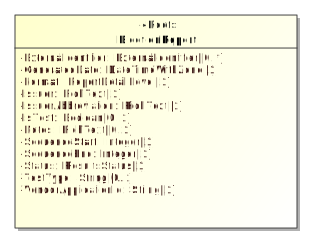
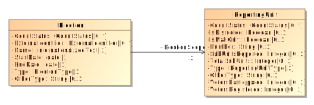

# Mapping Common Data Formats

<!-- TOC -->

- [Mapping Common Data Formats](#mapping-common-data-formats)
    - [Background](#background)
    - [Root Element](#root-element)
    - [Data Type Mapping](#data-type-mapping)
    - [Properties](#properties)
        - [Associations](#associations)
        - [References](#references)
            - [JSON References](#json-references)
            - [XML References](#xml-references)
    - [Representing multiplicities](#representing-multiplicities)
        - [Multiplicities in XML](#multiplicities-in-xml)
        - [Multiplicities in JSON](#multiplicities-in-json)
    - [Generalization](#generalization)
        - [Abstract Classes](#abstract-classes)
        - [Generalizations in JSON](#generalizations-in-json)
        - [Generalizations in XML](#generalizations-in-xml)
    - [XML specific notes](#xml-specific-notes)
        - [Elements and Attributes](#elements-and-attributes)
        - [Simple Content](#simple-content)
    - [Mapping Terminology](#mapping-terminology)

<!-- /TOC -->

## Background

The development of the NIST 1500 series Common Data Formats (CDFs) has followed a Model Driven Architecture (MDA) approach. This means that a high level model of the common data format is developed, and then transformed into implementation formats that can be used by developers. This document provides background regarding how the NIST 1500 UML models map into the implementation formats.

> Examples used throughout this document are based on the [Election Results Reporting specification](https://github.com/usnistgov/ElectionResultsReporting), version 2

> This document is not intended to an introduction to UML, JSON or XML.

## Root Element

The UML Class Model is a graph data structure. However, the two supported implementation formats (JSON and XML) are hierarchical (also called a tree). All hierarchies must start with a root, which is indicated in the UML model as a class with the `«root»` stereotype applied.



Figure: Root element of the Election Results Reporting CDF

## Data Type Mapping

The UML model uses a number of primitive and specialized types based on the UML Metamodel and XML Schema.

|UML           |XML              |JSON     |JSON Format |
|--------------|-----------------|---------|------------|
|String        |xsd:string       |string   |            |
|date          |xsd:date         |string   |date        |
|boolean       |xsd:boolean      |boolean  |            |
|base64Binary  |xsd:base64Binary |string   |byte        |
|anyURI        |xsd:anyURI       |string   |uri         |
|float         |xsd:float        |number   |            |

## Properties

UML provides two mechanisms to represent properties between classifiers: attributes and associations.

- Generally, attributes are used for data types (see [Data Type Mapping](#data-type-mapping)) and enumerations.
- Associations are always used to represented properties between classes

### Associations

In the NIST 1500 CDFs, all associations are directed. A directed association either represents a reference to a class defined elsewhere (i.e. a reference), or the ownership of the class. A directed composition always represents an ownership relationship.

The navigable role end (i.e. the end with the arrow) will always have a multiplicity specified. However, the role name may be omitted. In this case, the role takes the name of the class it refers.



Figure: A directed association with a role name

The role name becomes the name of JSON property or XML element. The following example shows how the above UML is represented in XML:

```xml
<ElectionReport>
	<Election>
		...
		<ElectionScopeId>gp-summit-county</ElectionScopeId>
		...
	</Election>
	<GpUnit ObjectId="gp-summit-county">
		<Name>Summit County</Name>
	</GpUnit>
</ElectionReport>
```

Figure: Representation of directed association.

> Directed associations that represent reference relationships have `Id` or `Ids` (if the upper cardinality is > 1) appended to them.

### References

Some classes of data may be referenced again and again, for example political parties or geopolitical units. It would make sense to put instances of these classes in single location and reference them whenever they are needed.

The CDF model represents these references as directed associations between classes.

Here we define a reusable `ReportingUnit` that is referenced by multiple `Contests`.


Figure: Representation of a UML Instance using references.

#### JSON References

JSON references are handled by the use of an `@id` property.

Example:

```json
{
	"@type": "ElectionResults.ElectionReport",
	"Election": [
		{
			"@type": "ElectionResults.Election",
			"Contest": [
				{
					"@id": "cc-sc-sherif",
					"@type": "ElectionResults.CandidateContest",
					"ElectoralDistrict": "gp-summit-county",
					"Name": "Summit County Sherif"
				},
				{
					"@id": "cc-sc-fiscal-officer",
					"@type": "ElectionResults.CandidateContest",
					"ElectoralDistrict": "gp-summit-county",
					"Name": "Summit County Fiscal Officer"
				}
			],
			"Type": "general"
		}
	],
	"GpUnit": [
		{
			"@id": "gp-summit-county",
			"@type": "ElectionResults.ReportingUnit",
			"Name": "Summit County"
		}
	]
}
```

Figure: Example of references in JSON

#### XML References

XML provide two built in types for handling references, one for establishing the reusable element (`xsd:ID`) and one for its pointer (`xsd:IDREF`).

```xml
<ElectionReport>
	<Election>
		<Contest ObjectId="cc-sc-sherif" xsi:type="CandidateContest">
			<ElectoralDistrictId>gp-summit-county</ElectoralDistrictId>
			<Name>Summit County Sherif</Name>
		</Contest>
		<Contest ObjectId="cc-sc-fiscal-officer" xsi:type="CandidateContest">
			<ElectoralDistrictId>gp-summit-county</ElectoralDistrictId>
			<Name>Summit County Fiscal Officer</Name>
		</Contest>
		<ElectionScopeId>gp-summit-county</ElectionScopeId>
		<Type>general</Type>
	</Election>
	<GpUnit ObjectId="gp-summit-county">
		<Name>Summit County</Name>
	</GpUnit>
</ElectionReport>
```

Figure: Example of references in XML

Identifiers are defined using the `ObjectId` attribute.  The name of the identifier must be unique across the XML instance and conform to restrictions specified by the `xsd:NCName` datatype.

> An `xsd:NCName` value must start with either a letter or underscore and may contain only letters, digits, underscores, hyphens, and periods.

## Representing multiplicities

Some properties in the UML model can repeat. Repetition is represented by multiplicities whose lower or upper cardinality is greater than one. For example, `1..2`, `2..4`, `0..*`, etc.

> An asterisk (*) for the upper cardinality represents an unbounded number of repetitions.

### Multiplicities in XML

UML properties with multiplicities greater than one are represented in XML as repeating elements.

Example:

```xml
<Uri Annotation="mobile">http://mobile.samplesite.com/</Uri>
<Uri Annotation="desktop">http://www.samplesite.com/</Uri>
```

### Multiplicities in JSON

UML attributes with upper cardinality greater than one are represented in JSON as an array of objects.

Example:

```json
"Uri":
    [
        {
            "@type": "ElectionResults.AnnotatedUri",
            "Annotation": "mobile",
            "Content": "http://mobile.samplesite.com/"
        },
        {
            "@type": "ElectionResults.AnnotatedUri",
            "Annotation": "desktop",
            "Content": "http://www.samplesite.com/"
        }
    ]
```

> Even if implementer wants to provide a single occurrence of an attribute, if its upper cardinality is greater than one, it must be wrapped in an array.

Example:

```json
"Uri":
    [
        {
            "@type": "ElectionResults.AnnotatedUri",
            "Annotation": "mobile",
            "Content": "http://mobile.samplesite.com/"
        }
    ]
```


## Generalization

Some classes represent specializations of other classes. In this case, the common properties of the class may be generalized into a single parent class (the supertype), and the specializations of this class (the subtypes) inherit those common properties.

Generalizations are represented in UML as arrows with a hollow head.

### Abstract Classes

Some classes are abstract, meaning that the class cannot be used directly. Instead, they must always be used in the context of a subtype. Abstract classes are indicated by placing their names in *italic type*.

### Generalizations in JSON

Generalizations in JSON are indicated by using the `@type` property.

```json
"Contest": [
	{
		"@id": "cc-sc-sherif",
		"@type": "ElectionResults.CandidateContest",
		"ElectoralDistrict": "gp-summit-county",
		"Name": "Summit County Sherif"
	}
]
```

### Generalizations in XML

Generalizations in XML are represented using the `xsi:type` attribute.

```xml
<Contest ObjectId="cc-sc-sherif" xsi:type="CandidateContest">
	<ElectoralDistrictId>gp-summit-county</ElectoralDistrictId>
	<Name>Summit County Sherif</Name>
</Contest>
```

> All elements of the parent class must appear before **any** of the elements for the child class.

A namespace declaration must be specified for `xsi`, e.g.

```xml
<ElectionReport xmlns:xsi="http://www.w3.org/2001/XMLSchema-instance">
...
</ElectionReport>
```

## XML specific notes

### Elements and Attributes

XML provides two data structures for presenting data, `attributes` and `elements`. Attributes are typically used for metadata, while elements are used for the class' primary data.

> UML and JSON only provide a single data structure for presenting information, attributes (UML) and objects (JSON), respectively.

Attributes of the UML Model are transformed into XML elements, unless the UML attribute has the `«xmlAttribute»` stereotype or the class contains an attribute with the `«simpleContent»` stereotype (see below).

### Simple Content

Some classes in the UML model may have an attribute with the `«simpleType»` stereotype applied. This stereotype indicates that the attribute is the target for the character data of the XML element. All other UML attributes will be transformed into XML attributes.

Example:

|File                                       |
|-------------------------------------------|
|`«simpleContent»`-Data : base64Binary [1]|
|-fileName : string [0..1]                  |
|-mimeType : string [0..1]                  |

Table: UML Class File

```xml
<FileValue fileName="String" mimeType="String">UjBsR09EbGhjZ0dTQUxNQUFBUUNBRU1tQ1p0dU1GUXhEUzhi<FileValue>
```

## Mapping Terminology

Terminology can be difficult because JSON, UML, and XML all developed independently and use different terms to represent similar concepts. An attempt at mapping these concepts is found below:

|UML         |XML Schema   |JSON Schema |
|------------|-------------|------------|
|Class       |type         |object      |
|Property    |type         |property    |
|Enumeration |enumeration  |enum        |
|Supertype   |extensionBase|N/A         |
|Multiplicity|occurrence   |(min/max) items|
|Cardinality |bounding     |min/max     |

> UML uses the term `property` to refer to either an `attribute` or an `association`.