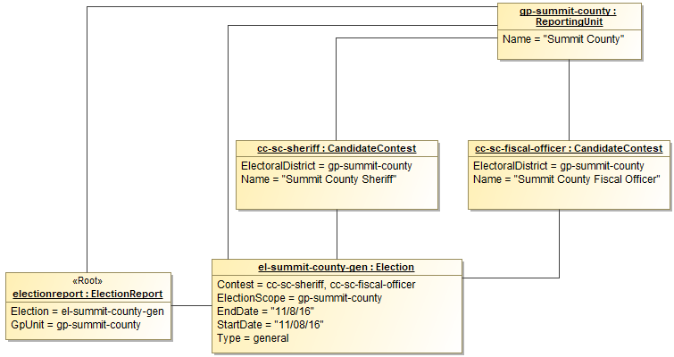

# Mapping Common Data Formats

## Background

The development of the Common Data Formats has followed a Model Driven Architecture approach. This means that a high level model of the common data format is developed, and then transformed into implementation formats that can be used by developers.

## Root Element

The UML Class Model is a graph data structure. However, the two supported implementation formats (JSON and XML) are hierarchical (also called a tree). All hierarchies must start with a root, which is indicated in the UML model as a class with the `«root»` stereotype applied.

## Data Type Mapping

The UML model uses a number of primitive and specialized types based on the XML Schema.

|UML           |XML              |JSON     |JSON Format |
|--------------|-----------------|---------|------------|
|String        |xsd:string       |String   ||
|date          |xsd:date         |String   |date|
|boolean       |xsd:boolean      |Boolean  ||
|base64Binary  |xsd:base64Binary |String   |byte|
|anyURI        |xsd:anyURI       |String   |uri|
|float         |xsd:float        |number   ||

## Representing multiplicities

Some attributes in the UML model can repeat. Repetition is represented by multiplicities whose lower or upper cardinality is greater than one. For example, `1..2`, `2..4`, `0..*`, etc.

> An asterisk (*) for the upper cardinality represents an unbounded number of repetitions.

### Multiplicities in XML

UML attributes with multiplicities greater than one are represented in XML as repeating elements.

Example:

```xml
<Uri Annotation="mobile">http://mobile.samplesite.com/</Uri>
<Uri Annotation="desktop">http://www.samplesite.com/</Uri>
```

### Multiplicities in JSON

UML attributes with multiplicities greater than one are represented in JSON as an array of objects.

Example:

```json
"Uri":
    [
        {
            "@type": "ElectionResults.AnnotatedUri",
            "Annotation": "mobile",
            "Content": "http://mobile.samplesite.com/"
        },
        {
            "@type": "ElectionResults.AnnotatedUri",
            "Annotation": "desktop",
            "Content": "http://www.samplesite.com/"
        }
    ]
```

> Even if implementer wants to provide a single occurrence of an attribute, it must be wrapped in an array.

Example:

```json
"Uri":
    [
        {
            "@type": "ElectionResults.AnnotatedUri",
            "Annotation": "mobile",
            "Content": "http://mobile.samplesite.com/"
        }
    ]
```

## References

Some classes of data may be referenced again and again, for example political parties or geopolitical units. It would make sense to put instances of these classes in single location and reference them whenever they are needed.

The CDF model represents these references as directed associations between classes.

Here we define a reusable `ReportingUnit` that is referenced by multiple `Contests`.


Figure: Representation of a UML Instance using references.

### JSON References

JSON references are handled by the use of an `@id` property.

Example:

```json
{
	"@type": "ElectionResults.ElectionReport",
	"Election": [
		{
			"@type": "ElectionResults.Election",
			"Contest": [
				{
					"@id": "cc-sc-sherif",
					"@type": "ElectionResults.CandidateContest",
					"ElectoralDistrict": "gp-summit-county",
					"Name": "Summit County Sherif"
				},
				{
					"@id": "cc-sc-fiscal-officer",
					"@type": "ElectionResults.CandidateContest",
					"ElectoralDistrict": "gp-summit-county",
					"Name": "Summit County Fiscal Officer"
				}
			],
			"Type": "general"
		}
	],
	"GpUnit": [
		{
			"@id": "gp-summit-county",
			"@type": "ElectionResults.ReportingUnit",
			"Name": "Summit County"
		}
	]
}
```

Figure: Example of references in JSON

### XML References

XML provide two built in types for handling references, one for establishing the reusable element (`xsd:ID`) and one for its referent (`xsd:IDREF`).

```xml
<ElectionReport>
	<Election>
		<Contest ObjectId="cc-sc-sherif" xsi:type="CandidateContest">
			<ElectoralDistrictId>gp-summit-county</ElectoralDistrictId>
			<Name>Summit County Sherif</Name>
		</Contest>
		<Contest ObjectId="cc-sc-fiscal-officer" xsi:type="CandidateContest">
			<ElectoralDistrictId>gp-summit-county</ElectoralDistrictId>
			<Name>Summit County Fiscal Officer</Name>
		</Contest>
		<ElectionScopeId>gp-summit-county</ElectionScopeId>
		<Type>general</Type>
	</Election>
	<GpUnit ObjectId="gp-summit-county">
		<Name>Summit County</Name>
	</GpUnit>
</ElectionReport>
```

Figure: Example of references in XML

Identifiers are defined using the `ObjectId` attribute.  The name of the identifier must be unique across the XML instance and conform to restrictions specified by the `xsd:NCName` datatype.

> An `xsd:NCName` value must start with either a letter or underscore and may contain only letters, digits, underscores, hyphens, and periods.

## XML specific notes

### Elements and Attributes

XML provides two data structures for presenting data, `attributes` and `elements`. Attributes are typically used for metadata, while elements are used for the class' primary data.

> UML and JSON only provide a single data structure for presenting information, attributes (UML) and objects (JSON), respectively.

Attributes of the UML Model are transformed into XML elements, unless the UML attribute has the `«xmlAttribute»` stereotype or the class contains an attribute with the `«simpleContent»` stereotype (see below).

### Simple Content

Some classes in the UML model may have an attribute with the `«simpleType»` stereotype applied. This stereotype indicates that the attribute is the target for the character data of the XML element. All other UML attributes will be transformed into XML attributes.

Example:

|File                                       |
|-------------------------------------------|
|`«simpleContent»`-Data : base64Binary [1]|
|-fileName : string [0..1]                  |
|-mimeType : string [0..1]                  |

Table: UML Class File

```xml
<FileValue fileName="String" mimeType="String">UjBsR09EbGhjZ0dTQUxNQUFBUUNBRU1tQ1p0dU1GUXhEUzhi<FileValue>
```