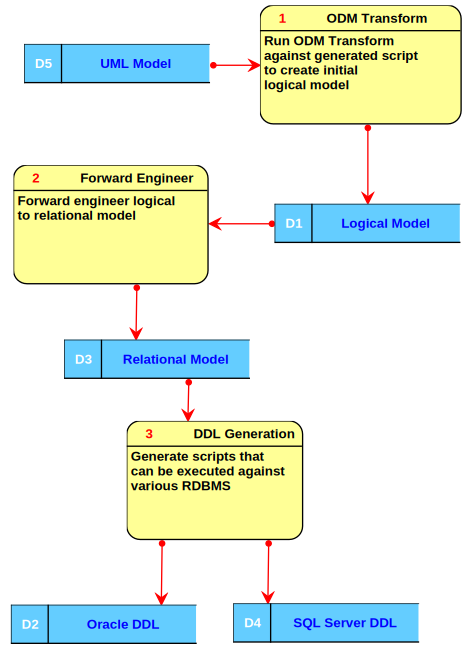
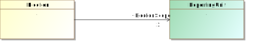
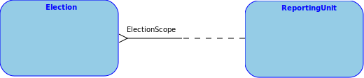
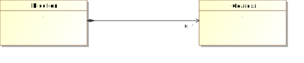
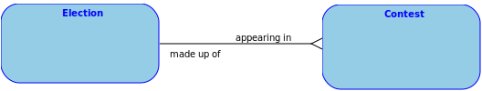
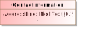
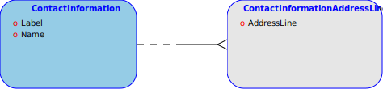
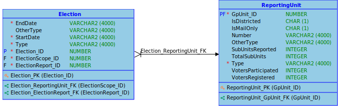

# Common Data Formats and the Entity-Relational Model

<!-- TOC -->

- [Common Data Formats and the Entity-Relational Model](#common-data-formats-and-the-entity-relational-model)
    - [Executive Summary](#executive-summary)
    - [Getting Started](#getting-started)
        - [DDL Support](#ddl-support)
            - [Oracle DDL Notes](#oracle-ddl-notes)
            - [SQL Server DDL Notes](#sql-server-ddl-notes)
        - [Additional Tasks](#additional-tasks)
            - [Data Type Length](#data-type-length)
            - [Subtype Engineering](#subtype-engineering)
    - [Repeating attributes of enumeration types](#repeating-attributes-of-enumeration-types)
    - [Technical Approach](#technical-approach)
    - [Mapping Internals](#mapping-internals)
        - [Multiplicities](#multiplicities)
        - [Directed associations](#directed-associations)
            - [Example directed association](#example-directed-association)
        - [Directed compositions](#directed-compositions)
            - [Example directed composition](#example-directed-composition)
        - [Attributes](#attributes)
            - [Primitives and Enumerations](#primitives-and-enumerations)
                - [Repeating primitive/enumeration example](#repeating-primitiveenumeration-example)
            - [Classes](#classes)
        - [Role Mapping](#role-mapping)
            - [Example Role Mapping](#example-role-mapping)
    - [Data Types](#data-types)

<!-- /TOC -->

## Executive Summary

The [NIST Special Publication (SP) 1500 series common data formats](https://nist.ent.sirsi.net/client/en_US/default/search/results?qu=%22Special+Publication+1500%22&te=ILS&lm=NISTPUBS&rt=false%7C%7C%7CSERIES%7C%7C%7CSeries) were developed from a high level UML model ([more here](../mapping/mapping.md)). One advantage of this approach is that many implementation formats can be derived from it. NIST provides JSON and XML schemas, but other formats are possible.

Although NoSQL has picked up some traction, the vast majority of systems of record (e.g. Election Management System) continue to use the relational (SQL) databases. To interoperate between such systems, it must map not only the syntax of JSON or XML, but also the semantics, or meaning of the data. The difficulty of mapping can be eased somewhat if both the system of record and CDFs use the same conceptual definitions.

This prototype explores the use of the developed UML models to derive relational schemas, such that the same conceptual definitions are shared.

## Getting Started

It is recommended to start with the pregenerated SQL Data Definition Language (DDL) scripts. If these scripts do not serve your needs, you can edit the Entity-Relational (logical) or relational model directly using the freely available [Oracle Data Modeler](https://www.oracle.com/tools/downloads/sql-data-modeler-downloads.html) and generate new DDL.

The Relational Database Management System (RDBMS) format specific files are located in the [CVR/relational](../CVR/relational) and [ENR/v2/relational](../ENR/v2/relational) directories of this repository, respectively.

### DDL Support

DDL scripts have been provided for Oracle and SQL Server. You can also generate DB2 scripts from *Oracle Data Modeler*, but this has not been tested.

#### Oracle DDL Notes

- Generates names using under_score notation

#### SQL Server DDL Notes

- Generates names using CamelCase notation

### Additional Tasks

This task describes additional, optional tasks that can be performed to customize the DDL to meet your individual needs. You will need to use the [ODM designs](https://github.com/HiltonRoscoe/CDFOracleDataModels) to generate new DDL.

#### Data Type Length

While Entity-Relational (ER) models do not require the length of the data type to be specified, a practical reality of relational databases is that data type length needs to be specified. All String types are mapped to the maximum character length allowed by the database. However, you will likely want to adjust the lengths to suit your needs.

#### Subtype Engineering

The relational model has no concept of hierarchies (i.e. parent/child relationships). However, the concept can be simulated in a variety of ways, described below.

> Examples of parent/child relationships in CDFs include `Contest` (parent) and `CandidateContest` (child), or `ContestSelection` (parent) and `BallotMeasureSelection` (child).

- *Single Table*, subtype hierarchies flattened into a single table, a type discriminant used to determine which attributes should be used.
- *Table per child*, table includes all attributes of child and parent in single table
- *Table per entity*, maps 1-1 with UML model

The DDL provided as part of this repository uses the *table per entity* approach. However, if the ER model is adjusted to use a different method, and forward engineered to the relational model, the DDL can be regenerated.

## Repeating attributes of enumeration types

Repeating primitives can be mapped one of two ways:

- Each enumeration is given its own entity, with mapping tables to resolve many-to-many
- Each enumeration/attribute combination is given its own entity, with a many to one relationship.

The ER and relational models use the second approach. It is strongly recommended to accept this approach, as the first leads to a much more complex relational model. This setting cannot be changed in Oracle Data Modeler (ODM). Please contact [Hilton Roscoe](mailto:info@hiltonroscoe.com) for customization options.

## Technical Approach

The relational model was mechanically derived from the UML class model, using previously developed Model Driven Architecture (MDA) tools. A script was constructed to translate the representations in UML to equivalent structures in ODM's Entity-Relational model. The ER model was forward-engineered to the relational model (either Oracle or SQL Server), and finally DDL generated for each database.

## Mapping Internals

> Warning: This section assumes a fundamental knowledge of The Entity-Relational and UML Class Models. Understanding of this material is **NOT** required to use the prototype.

> This section uses [Barker Entity-Relational notation](https://www.essentialstrategies.com/publications/modeling/barker.htm).

The Unified Modeling Language (UML) and the Entity-Relational (ER) model are quite different. The following sections describe how the UML Classes and associations were mapped to equivalent structures in the ER model.

### Multiplicities

UML and ER uses language somewhat differently. Multiplicity in UML refers to how many instances of something may or must appear. In ER, two concepts are used, *cardinality* and *optionality*. Cardinality can be seen as representing the upper bound, i.e. `*` in the UML multiplicity `1..*`. Cardinality allows for descriptions of one (`1`) or many (`*`). A UML upper bound of `5`, would become a cardinality of `*`. To represent the lower bound, optionality can be set (`optional` or `mandatory`).

### Directed associations

UML *directed associations* are mapped to ER *relations*. The association source end (e.g. the end without an arrow) plays no part in the mapping. The target end is mapped to a cardinality of `1` if its multiplicity is `0..1` or `1`, otherwise it is mapped to `*`. The optionality for the source end is always `optional`, as the entity may be instantiated without the relationship (unlike directed compositions). The optionality for the target is based on the lower cardinality being greater than zero.

|End      |Cardinality|Optional  |
|---------|---------  |----------|
|Source   |*          |Yes       |
|Target   |`*` if upper multiplicity > 0 else `1` | `Yes` if lower multiplicity = 0 else `No`         |

#### Example directed association

In this example, the `Election` class has a directed association with `ReportingUnit`. Additionally, a *Role Name* is set on the target end. In the translated ER model, `ElectionScope` becomes a role on election (which will influence the generated foreign key name in the relational model). Note also that each `ReportingUnit` *may be scoping one or more `Election`* (the crow's foot).

### Directed compositions

Directed compositions behave like directed associations, except that their source end is never optional. This is because the composition is stating a part/whole relationship.

|End      |Cardinality|Optional  |
|---------|---------  |----------|
|Source   |1          |No        |
|Target   |`*` if upper multiplicity > 1 else `1` | Yes if lower multiplicity = 0 else No         |

#### Example directed composition

In this example, `Election` composes zero or more `Contest`. In the translated ER model, the relationship is required on both ends (notated by the solid line on both sides), and the cardinality is indicated with the crow's foot.

### Attributes

UML attributes are mapped to ER attributes, except when the upper multiplicity is greater than 1 or the attribute represent a non-primitive type (i.e. a class). In that case they are mapped to their own entity. This is done to preserve First Normal Form (1NF).

#### Primitives and Enumerations

UML primitives and enumerations are mapped to relational attributes, except when the UML attribute's upper multiplicity is greater than 1. In this case it is mapped to its own entity. This entity takes the name of the parent class. So if `CastVoteRecordReport` contains an attribute of type `ReportType`, the generated entity will be named `CastVoteRecordReportType`.

[should be identifying? They aren't now]

|End      |Cardinality|Optional  |
|---------|---------  |----------|
|Source   |1          |No        |
|Target   |`*` if upper multiplicity > 1 else `1` | Yes if lower multiplicity = 0 else No         |

##### Repeating primitive/enumeration example

The `AddressLine` has an UML  multiplicity of `0..*`. In the translated ER model, a new entity is created with a name in the form of `{ClassName}{AttributeName}`.

#### Classes

UML attributes whose type is a class are given their own entity. This entity takes the name of the parent class. So if `GpUnit` contains an attribute of type `Code`, the generated class will be named `GpUnitCode`

|End      |Cardinality|Optional  |
|---------|-----------|----------|
|Source   |*          |Yes       |
|Target   |`*` if upper multiplicity > 0 else `1` | Yes if lower multiplicity = 0 else No         |

### Role Mapping

The Entity-Relational model has no conception of roles. However, ODM supports passing role names through in order to influence the names of foreign keys columns in the relational model.

Role mapping `fkRole` is handled as follows:

|Upper Multiplicity  |FK owner         |FK Name   |
|---------           |-----------------|----------|
|*                   |source           |Class name|
|1                   |target           |Property name|

Must add handling for many to many manually

#### Example Role Mapping

Without the fkRole being set, the foreign key column will take the name of the reference table, e.g. GpUnit_ID (for Election_ReportingUnit_FK). In this case, the role name is `ElectionScope` and the FK column becomes `ElectionScope_ID`.

## Data Types

Data types in the UML model are mapped to equivalent types in the ER model. ER data types can be either [`Logical` data types](https://docs.oracle.com/en/database/oracle/sql-developer-data-modeler/20.2/dmdug/data-modeler-concepts-usage.html#GUID-D020296C-BFCE-4520-88FB-1A62B7138212) or [`Domain` data types](https://en.wikipedia.org/wiki/Attribute_domain). Logical data types map directly to the physical type used by the database. Domain data types can be seen a subtypes of logical types, allowing them to be further constrained. For example, enumerations in the UML model are represented as domain types of the same name.

|UML Type|Relational Type  | Oracle Type | SQL Server Type
|--------|----------       |-------------|---------------|
|Integer |Integer          | INTEGER     | INTEGER
|Float   |Numeric          | NUMBER      | NUMERIC
|Double  |Numeric          | NUMBER      | NUMERIC
|Boolean |Boolean          | NUMBER      | BIT
|String  |String           | VARCHAR2    | VARCHAR
|DateTime|Timestamp        | TIMESTAMP   | DATETIME
|Byte    |BLOB             | BLOB        | IMAGE

Enumerations become identically named domains types of logical type `String`. The enumeration values form the *value list*, which will become a `CHECK` constraint in the generated `DDL`.
