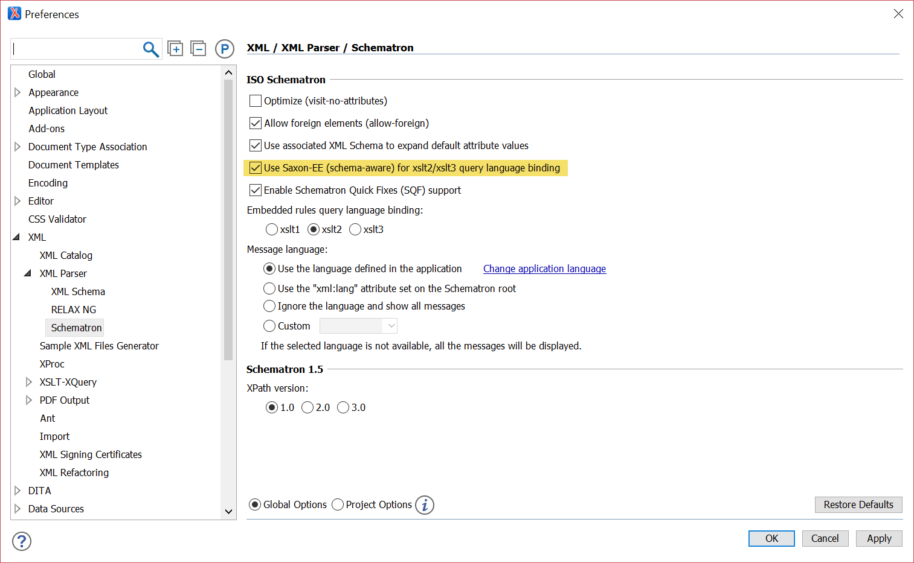
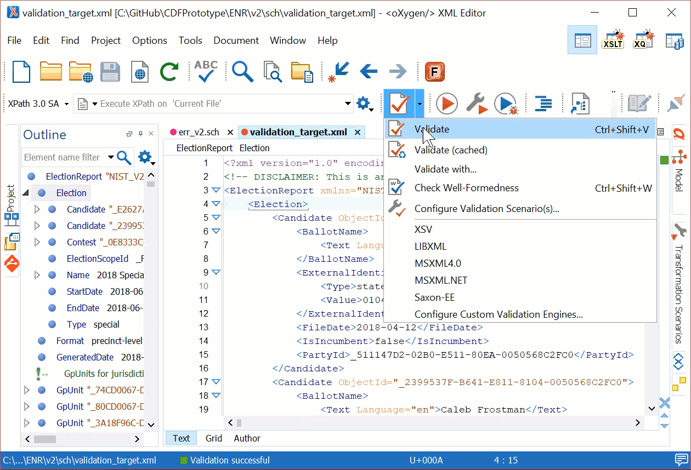

# Schematron Rulesets

This document contains instructions to run the schematron rulesets for the Cast Voter Records and Election Results Reporting specifications.

<!-- TOC -->

- [Schematron Rulesets](#schematron-rulesets)
    - [How to run (AltovaXML)](#how-to-run-altovaxml)
        - [Expected Output](#expected-output)
    - [How to Run (Oxygen XML)](#how-to-run-oxygen-xml)
    - [Other Notes](#other-notes)

<!-- /TOC -->

There are multiple ways to run the Schematron rulesets. The compiled Schematron rulesets can be run with any schema-aware `XSLT2` processor. Additionally the schematron rulesets can be run directly in a tool like `Oxygen`. The Schematron files are located in `CVR/sch` and `ENR/v2/sch` directories of this repository, respectively.

## How to run (AltovaXML)

AltovaXML can run a schematron ruleset that has been compiled into an `xslt`, e.g. `err_v2-compiled.xsl`. Precompiled rulesets have been provided as part of this repository. AltovaXML is available on Windows only.

- [Download](http://cdn.sw.altova.com/v2013r2/en/AltovaXMLCmu2013.exe) and install AltovaXML.

> AltovaXML must be in your path or fully qualified. The default installation path for x64 based computers is `C:\Program Files (x86)\Altova\AltovaXML2013`

- (Optional) Change line 31 of the `*_compiled.xsl` file to point to the fully qualified path of the NIST 1500-xxx schema. AltovaXML does not understand relative paths.

```xml
<xsl:import-schema xmlns:sch="http://purl.oclc.org/dsdl/schematron"
                    xmlns:sqf="http://www.schematron-quickfix.com/validator/process"
                    namespace="NIST_V2_election_results_reporting.xsd"
                    schema-location="file:///{path}"/>
```

> The compiled schematron files reference the xsds found on the NIST GitHub repository. Therefore, this step is optional, however, if the url of the files changes or network connectivity is restricted, the transforms will not run correctly.

- Run the command having the form of:

```cmd
{AltovaXML} /xslt2 {compiled.xsl} /in {input_file.xml}
```

Where `{AltovaXML}` is the path to the `AltovaXML.exe` executable, `{compiled.xsl}` is the path to the compiled schematron ruleset, and `{input_file.xml}` is the path to the XML instance to validate.

```cmd
PS C:\Program Files (x86)\Altova\AltovaXML2013> .\AltovaXML.exe /xslt2 C:\GitHub\CDFPrototype
\ENR\v2\sch\err_v2-compiled.xsl /in C:\GitHub\CDFPrototype\ENR\v2\sch\validation_target.xml
```

### Expected Output

If the instance file contains no errors, the command will produce no output.

> Make sure the file has been validated against the XML Schema prior to running the schematron rules. Failure to do so may result in false negatives.

If the file contains errors, messages such as the one below will appear.

```message
XSL message: PartyId (_PE2399537F-B641-E811-8104-0050568C2FC0) must point to an element of type Party
```

Each error is prefixed with `XSL message` and contains the `ObjectId` context indicating where the error occurred.

## How to Run (Oxygen XML)

The commercial XML editor [Oxygen](https://www.oxygenxml.com/download.html) can validate using schematron rulesets directly. Make sure schema-aware validation is enabled and Saxon-EE is used for validation.



The below video shows how to validate a XML instance using the `sch` ruleset.



> These instructions were tested on Windows 10.0.17134.648 (x64) using Oxygen 21.0

## Other Notes

XSLT versions of Schematron files were generated using the default transformer provided by Oxygen.